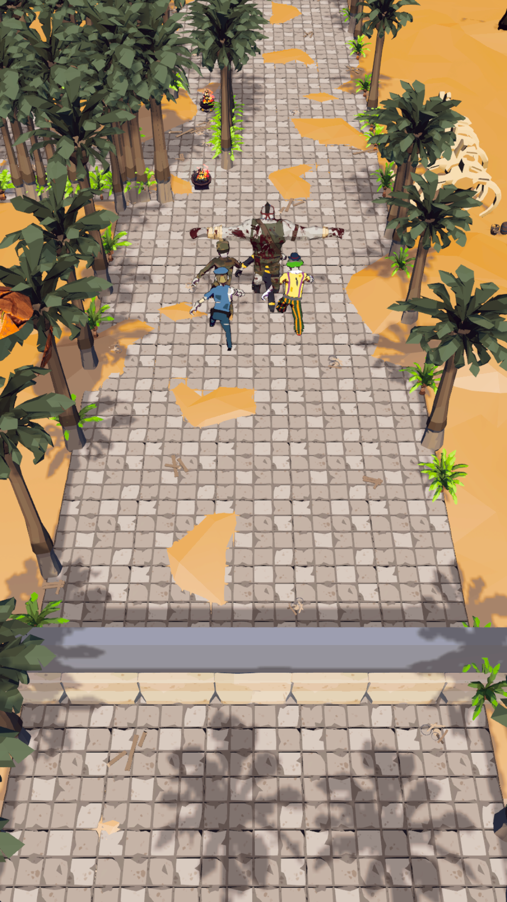

# Abilities

**An in-development action / tower-defense game built in Unity 6.**

Abilities combines fast spell casting, large enemy waves, elemental interactions, and long-term progression. The project is currently approximately **80% complete**.

This public repository is a portfolio presentation for the game. The production source code, internal architecture, development workflow, and private configuration are not included.

## Gameplay

- Cast projectiles, beams, zones, and other distinct spell types.
- Combine elements to produce additional spell reactions.
- Defend the barrier against increasingly difficult enemy waves.
- Choose and improve abilities as the challenge escalates.
- Progress through stages, biomes, rewards, and persistent upgrades.
- Fight boss waves and pursue stronger results across repeated runs.

## What the project utilizes

- **Unity 6** as the game engine.
- **C#** for gameplay and tools.
- **Unity DOTS / Entities and Burst** for high-volume gameplay simulation.
- **Unity Physics** and crowd navigation for combat and enemy movement.
- **ScriptableObjects** for configurable gameplay content.
- **PlayFab-backed services** for online progression and live-game features.
- **Git** for version control.

These technologies are listed to describe the production stack. Implementation details remain private.

## Current status

Core gameplay and most supporting systems are implemented. Current work is focused on completing content, presentation, balancing, integration, and final verification.

## Media

This image was captured directly from the current development build. Additional spell-combat screenshots and short clips are being prepared; see the [capture checklist](media/README.md).

## Other completed Unity work

I also developed a complete game for an academic project. [Watch the gameplay video on YouTube](https://www.youtube.com/watch?v=dwjT-gcPdSE).

## Developer

[**Lior Kantor / UncannyKenny**](https://github.com/UncannyKenny) — software engineer and Unity developer interested in creative, satisfying, reward-driven gameplay.

